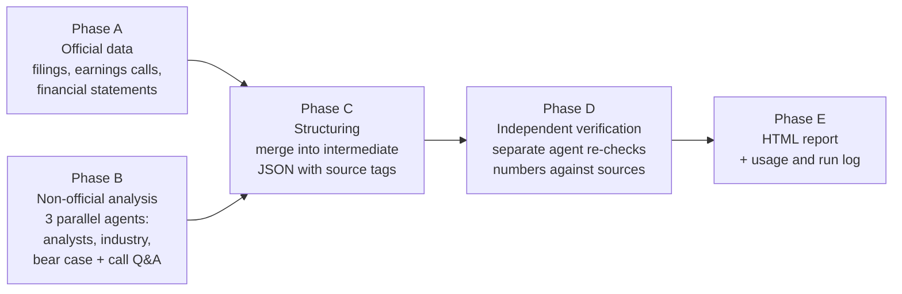

# tw-stock-research

**English** | [繁體中文](README.zh-TW.md)

Claude Code skills that turn a single ticker into an **auditable** equity research report — one self-contained HTML file with charts, where every number links back to its source and has been through an independent verification pass.

- **`tw-stock-research`** — Taiwan-listed stocks (TWSE / TPEx)
- **`us-stock-research`** — US-listed stocks (SEC filings)

The goal is not a pretty write-up. It is a report you can check: if a number cannot be traced to a source, it is left out rather than estimated.

## Usage

Open this folder in [Claude Code](https://claude.com/claude-code) and type a ticker or company name, optionally with a theme to dig into:

```text
3533
幫我看一下台積電 CoWoS
NVDA AI data center
```

If no theme is given, the skill picks the one or two themes that drive the latest quarter's revenue and says so at the top of the report. Reports are written to `reports/` (git-ignored).

## How it works



Phases A and B run in subagents. The skills never write and research at the same time, so a number found later cannot be silently contradicted by a paragraph written earlier.

### Source tiers

Every number in a report carries a tier label. When sources conflict, the higher tier wins.

| Tier | Meaning | Taiwan examples | US examples |
|---|---|---|---|
| **L1 Official** | Published by the company | MOPS earnings-call decks, financial statements, monthly revenue | 10-K / 10-Q / 8-K and exhibits |
| **L1′ Derived** (US only) | Structured L1 data that links back to the filing | — | Polygon XBRL financials |
| **L2 Analyst / research** | Professional forecasts and analysis | Broker notes, TrendForce, DIGITIMES | Analyst price targets |
| **L3 Media / community** | Second-hand or personal views | Financial media, forums | News, forums |

Three rules hold across both skills:

1. **If it can't be found, say so.** No filling gaps with industry averages, peer numbers, or interpolation.
2. **The official section holds L1 only.** Third-party estimates of undisclosed figures go in a separate, attributed section.
3. **Only verified items go in the main report.** Single-source breaking news goes in a "latest unverified" section.

### What a report contains

- Snapshot cards, latest-quarter financials, revenue breakdown by segment or product
- Official guidance, key management quotes, earnings-call Q&A highlights
- Analyst forecasts, an industry section with a CAGR comparison table, community views and the bear case
- Five charts: segment revenue mix, segment revenue, margins, revenue vs. EPS, and a P/E river chart
- Risks to watch, plus a source and verification log
- A personal notes area that is saved in the browser, with per-section PDF export (Taiwan template)

## Requirements

| Item | Needed for | Notes |
|---|---|---|
| [Claude Code](https://claude.com/claude-code) | Everything | Skills in `.claude/skills/` load automatically when you open this folder |
| Python 3 | Data scripts | Standard library only; nothing to `pip install` |
| `pdftotext` (poppler) | Reading earnings-call decks and filings | `brew install poppler` |
| Google Chrome | PDF export and Telegram sending | Used headless; optional |
| Polygon connector in Claude | US price and financials | Built-in Claude connector |

### Environment variables

Put these in `.claude/settings.local.json`, which is git-ignored, so they never reach the repo:

```json
{
  "env": {
    "SEC_UA_EMAIL": "you@example.com"
  }
}
```

| Variable | Required | Purpose |
|---|---|---|
| `SEC_UA_EMAIL` | Yes, for US reports | SEC requires a contact email in the User-Agent; requests without one get HTTP 403 |
| `FINMIND_TOKEN` | No | Higher [FinMind](https://finmindtrade.com/) quota for Taiwan data; the free tier works without it |

### Optional: send reports to Telegram

The Taiwan report has a "send to TG" button. It converts the report to PDF on your machine and posts it to a Telegram channel. The bot token lives in `~/.config/tw-stock-tg/config.json`, outside the repo, and never appears in the report HTML. Setup steps, which use a macOS LaunchAgent, are in [`telegram-sending.md`](.claude/skills/tw-stock-research/references/telegram-sending.md).

## Cost

These skills are thorough, and that makes them expensive. According to `runlog/runs.jsonl`, a full report takes about **10–22M tokens** and **1–2 hours**. Most of that goes to reading filings and to the verification pass.

## Repository layout

```text
.claude/
├── hooks/block-pdf-rasterize.py   # blocks PDF→image conversion (an image page costs ~150x the tokens of its text)
├── settings.json                  # registers the hook
└── skills/
    ├── tw-stock-research/         # SKILL.md, verifier agent, report template, data scripts, references
    ├── us-stock-research/         # SKILL.md, verifier agent, SEC / AIHOT scripts, references
    └── aihot/                     # third-party AI news skill (see below)
runlog/runs.jsonl                  # problems hit on each run and how they were handled
UBIQUITOUS_LANGUAGE.md             # shared vocabulary for skills, prompts and reports
```

## Third-party components

- [`aihot`](.claude/skills/aihot/) is a skill by Virxact for the AIHOT Chinese AI news API, included under its [MIT License](.claude/skills/aihot/LICENSE). The US skill uses it for AI-ecosystem news.

## Disclaimer

Reports are compiled from public sources for research purposes only. They are not investment advice. Official figures are those published by the company and its regulators (MOPS for Taiwan, SEC EDGAR for the US).
