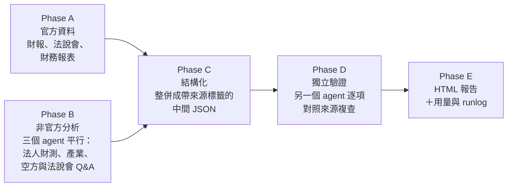

# tw-stock-research

[English](README.md) | **繁體中文**

一組 Claude Code skill：丟一個股票代號，產出一份**可稽核**的個股研究報告。報告是單一 HTML 檔，含圖表；每個數字都附來源連結，而且經過一輪獨立驗證。

- **`tw-stock-research`**：台股（上市／上櫃）
- **`us-stock-research`**：美股（SEC 財報）

重點不是寫得漂亮，而是報告能被查核。追不回出處的數字寧可不寫，也不拿估計值來補。

## 使用方式

用 [Claude Code](https://claude.com/claude-code) 開啟這個資料夾，輸入股票代號或公司名稱，想深入某個產業主題的話可以一起附上：

```text
3533
幫我看一下台積電 CoWoS
NVDA AI data center
```

沒給主題時，skill 會從最新一季營收挑出一到兩個主導主題，並在報告開頭說明選擇理由。報告輸出在 `reports/`（不進 git）。

## 運作方式



Phase A、B 都交給 subagent 執行。查資料與寫報告分開進行，避免後來查到的數字和先前寫好的段落互相矛盾。

### 資料來源分級

報告裡每個數字都標有等級，來源衝突時以等級高者為準。

| 等級 | 定義 | 台股例子 | 美股例子 |
|---|---|---|---|
| **L1 官方** | 公司自己發布的 | 公開資訊觀測站法說會簡報、財報、月營收 | 10-K／10-Q／8-K 及附件 |
| **L1′ 官方衍生**（僅美股） | 第三方結構化的 L1，帶得回原始 filing | — | Polygon XBRL 財報 |
| **L2 法人／研調** | 專業機構的財測與分析 | 券商報告、TrendForce、DIGITIMES | 分析師目標價 |
| **L3 媒體／社群** | 二手轉述或個人觀點 | 財經媒體、論壇 | 新聞、論壇 |

兩個 skill 共用三條不可妥協的規則：

1. **查不到就寫查不到。** 不用產業平均、同業數字或內插法補洞。
2. **官方區只放 L1。** 官方沒揭露的數字由第三方推估時，放在另一區並註明是誰推估的。
3. **主報告只放已驗證的內容。** 只有單一來源的最新消息，放進「最新未驗證動態」。

### 報告內容

- 速覽卡片、最新一季財務摘要、業務別或產品別營收拆解
- 官方財測與展望、管理層關鍵發言、法說會 Q&A 精華
- 法人財測彙整、產業分析（含 CAGR 對照表）、社群觀點與空方論述
- 五張圖：業務別營收占比、業務別營收金額、獲利能力趨勢、營收與 EPS、本益比河流圖
- 風險與觀察點、資料來源與驗證紀錄
- 個人筆記區（存在瀏覽器裡），可勾選章節匯出 PDF（台股模板）

## 環境需求

| 項目 | 用途 | 備註 |
|---|---|---|
| [Claude Code](https://claude.com/claude-code) | 全部 | 開啟資料夾後，`.claude/skills/` 底下的 skill 會自動載入 |
| Python 3 | 資料腳本 | 只用標準函式庫，不需要 `pip install` |
| `pdftotext`（poppler） | 讀法說會簡報與財報 | `brew install poppler` |
| Google Chrome | PDF 匯出、發送到 Telegram | 以 headless 模式執行；選用 |
| Claude 的 Polygon connector | 美股股價與財報 | Claude 內建 connector |

### 環境變數

寫在 `.claude/settings.local.json`。這個檔案已列入 `.gitignore`，不會進 repo：

```json
{
  "env": {
    "SEC_UA_EMAIL": "you@example.com"
  }
}
```

| 變數 | 是否必要 | 用途 |
|---|---|---|
| `SEC_UA_EMAIL` | 美股報告必要 | SEC 要求 User-Agent 帶聯絡信箱，沒帶會回 HTTP 403 |
| `FINMIND_TOKEN` | 選用 | 提高台股資料來源 [FinMind](https://finmindtrade.com/) 的額度；免費層不用 token 也能跑 |

### 選用：發送報告到 Telegram

台股報告上有「發送到 TG」按鈕，按下後會在本機把報告轉成 PDF，再發到 Telegram 頻道。Bot token 存在 `~/.config/tw-stock-tg/config.json`，位置在 repo 外面，也不會出現在報告 HTML 裡。設定步驟（使用 macOS LaunchAgent）見 [`telegram-sending.md`](.claude/skills/tw-stock-research/references/telegram-sending.md)。

## 成本

這組 skill 查得很徹底，相對也很花資源。依 `runlog/runs.jsonl` 的紀錄，一份完整報告約需 **1,000–2,200 萬 token**、**1–2 小時**，大部分花在讀財報與驗證上。

## 目錄結構

```text
.claude/
├── hooks/block-pdf-rasterize.py   # 擋掉把 PDF 轉成圖檔（一頁圖片的 token 約是文字的 150 倍）
├── settings.json                  # 註冊上面的 hook
└── skills/
    ├── tw-stock-research/         # SKILL.md、驗證 agent、報告模板、資料腳本、參考文件
    ├── us-stock-research/         # SKILL.md、驗證 agent、SEC／AIHOT 腳本、參考文件
    └── aihot/                     # 第三方 AI 資訊 skill（見下方）
runlog/runs.jsonl                  # 每次執行遇到的問題與處理方式
UBIQUITOUS_LANGUAGE.md             # skill、派工 prompt 與報告共用的術語表
```

## 第三方元件

- [`aihot`](.claude/skills/aihot/) 由 Virxact 開發，用來查詢 AIHOT 中文 AI 資訊 API，依其 [MIT License](.claude/skills/aihot/LICENSE) 收錄。美股 skill 用它掃描 AI 生態相關消息。

## 免責聲明

報告內容整理自公開資料，僅供研究參考，不構成投資建議。正式數據以公司及主管機關公告為準（台股為公開資訊觀測站，美股為 SEC EDGAR）。
